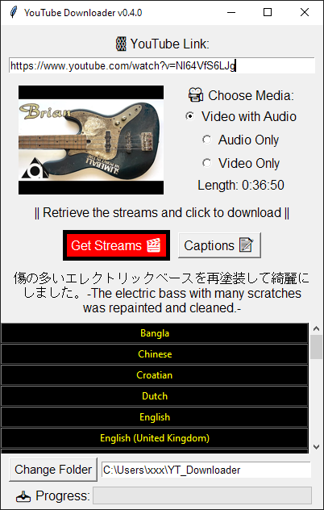

# Simple YouTube Downloader




YouTube Downloader is a simple Python script built with [Pytube](https://github.com/pytube/pytube/tree/master) and Tkinter that empowers you to effortlessly download YouTube videos, audio streams or captions.  
This application features a user-friendly interface, utilizing Tkinter for the GUI and Pytube for seamless YouTube content downloading.

YouTube Downloader is powered by Pytube a library for downloading YouTube videos.  
Due to slow bug fixing I switched to pytubefix from [Juan Bindez](https://github.com/JuanBindez)
Thank you to the Pytube community and especially to Juan Bindez for implementing the fixes ASAP and providing an alternative fork that works like a charm.

[Pytubefix](https://github.com/JuanBindez/pytubefix) Repository => https://github.com/JuanBindez/pytubefix  
[Pytube](https://github.com/pytube/pytube/tree/master) Repository => https://github.com/pytube/pytube/tree/master

## Features

- Fetch available streams for a given YouTube video link.
- Choose between video with audio, audio-only, or video-only streams.
- Switch to captions list for easy download of .srt subtitles.
- Download the selected stream to your specified folder.

## Standalone Builds (No Prerequisites)

Win/MacOS/Linux
**Download the Standalone Application =>** [Simple YT Downloader v0.2.2](https://github.com/4rtsy2wo/Simple-YT-Downloader/releases/tag/v0.2.2)
No Python installation required.

## Prerequisites for python install

The script is written in Python. Before using the YouTube Downloader, ensure you have Python installed on your machine.

[Python](https://www.python.org/) download link at https://www.python.org/

## Installation

### Clone the Repository:

```bash
git clone https://github.com/4rtsy2wo/Simple-YT-Downloader.git
cd Simple-YT-Downloader

# Create and activate a virtual environment (optional but recommended)
python -m venv venv  # Create a virtual environment

# On Windows:
.\venv\Scripts\activate
# On macOS/Linux:
source venv/bin/activate

# Install dependencies
pip install -r requirements.txt

# Run the script
python ytDL.py
```

OR

### Download the ZIP File:

1. Navigate to the GitHub repository of the YouTube Downloader script.
2. On the main page of the repository, look for a green button labeled "Code."
3. Click on the "Code" button, and a dropdown menu will appear.
4. Select "Download ZIP" from the menu.
5. Once the ZIP file is downloaded, locate it in your computer's Downloads folder or the location where your browser saves downloads.
6. Right-click on the ZIP file and choose "Extract All" (Windows) or "Open With" > "Archive Utility" (Mac).
7. This will create a new folder with the same name as the ZIP file.
8. Open a terminal or command prompt in this folder.

```bash
cd path/to/extracted/folder
# Create and activate a virtual environment (optional but recommended)
python -m venv venv  # Create a virtual environment

# On Windows:
.\venv\Scripts\activate
# On macOS/Linux:
source venv/bin/activate

# Install dependencies
pip install -r requirements.txt

# Run the script
python ytDL.py
```

## Usage

- **Enter YouTube URL:**
  Paste the YouTube video URL in the provided entry field.

- **Change Download Folder (Optional):**
  By default the download folder will be created in your home directory.
  Click the "Change Folder" button to choose a different download folder.

- **Choose Media Type:**
  Select the desired media type (Video with Audio, Audio Only, or Video Only) using the radio buttons.

- **Fetch Streams:**
  Click the "Get Streams" button to fetch available streams for the provided YouTube URL.

- **Select Stream:**
  Click on a stream button to select the desired stream for download.

- **Wait for the download to complete.**
  Progress is shown and a message box will confirm when the download is finished.

## Create a standalone Windows or MacOs application

```bash
git clone https://github.com/4rtsy2wo/Simple-YT-Downloader.git
cd Simple-YT-Downloader

# Create and activate a virtual environment (optional but recommended)
python -m venv venv  # Create a virtual environment

# On Windows:
.\venv\Scripts\activate
# On macOS/Linux:
chmod +x venv/bin/activate  # Set executable permissions if needed (macOS/Linux)
source venv/bin/activate     # Activate virtual environment

# Install dependencies
pip install -r requirements.txt

# Install pyinstaller
pip install pyinstaller

# Run pyinstaller
pyinstaller --onefile --noconsole --name YouTube_Downloader ytDL.py

```

Depending on your system this creates and .exe or .app file located in the /dist folder.
You can run this application now without python installed and with on click.

## Version Log

### 0.1.0

- Initial hack

### 0.2.0

- Added progress bar for downloads
- Improved UX arrangement
- Added version to window title

### 0.2.1

- Refactored code logic and GUI
- Added error handling and GUI output

### 0.2.2

- Changed default download folder to the home directory instead of the Windows video folder for macOS compatibility
- Updated subfolder names for downloads (Audio_Only, Video_Only, Video_with_Audio)
- Added filename sanitizing
- Appended Resolution/Average Bit Rate and codec to the end of the filename
- Windows standalone build

### 0.3.0

- centered app window at start
- seperated fetch and button logic
- download available captions for streams

### 0.4.0

- switched library to pytubfix (pytube fork with bug fixes) from [Juan Bindez](https://github.com/JuanBindez)
- added thumbnail for video url
- added title for url
- added length for url
- couple of changes reverted due working pytubfix fork

## Important Note

Downloading copyrighted content without permission may violate YouTube's terms of service. Make sure you have the right to download and use the content you are downloading.
